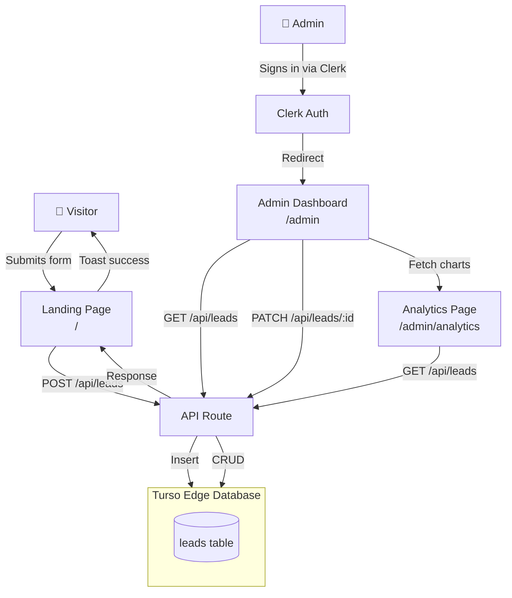
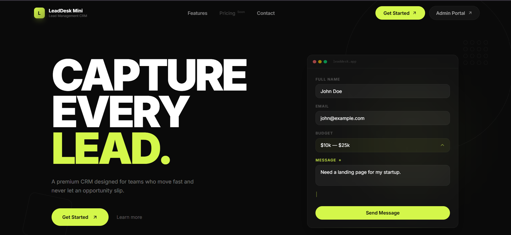
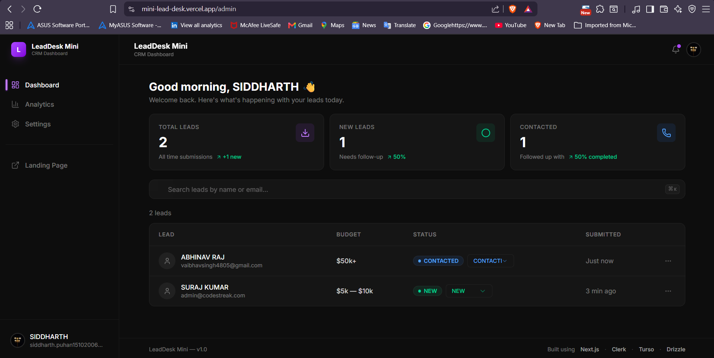
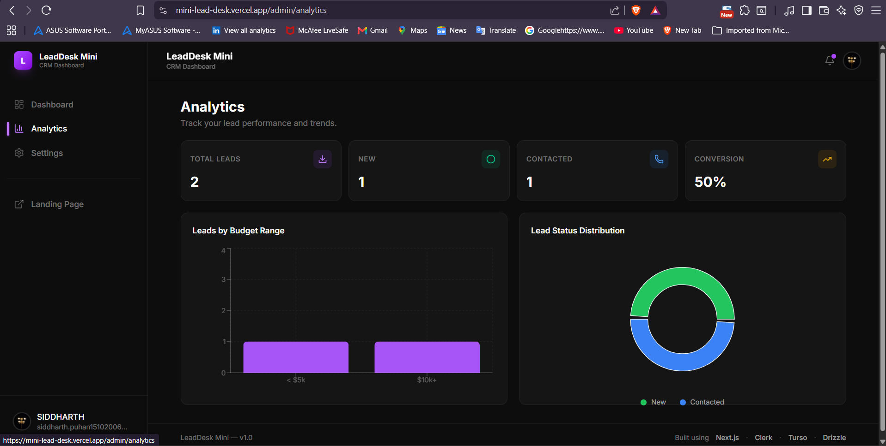
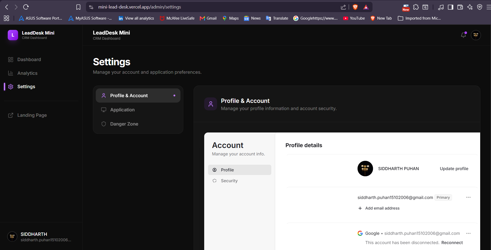

<p align="center">
  <picture>
    <source media="(prefers-color-scheme: dark)" srcset="https://img.shields.io/badge/dynamic/json?style=flat-square&label=⚡&color=%23D8FF3F">
  </picture>
</p>

<h1 align="center">LeadDesk Mini</h1>

<p align="center">
  <strong>Modern Lead Management CRM — Open Source SaaS Starter</strong>
</p>

<p align="center">
  A full-stack lead management system built with <strong>Next.js 16</strong>, <strong>React 19</strong>, and <strong>Turso</strong>.<br>
  Visitors submit inquiries through a public landing page; administrators manage leads through an authenticated dashboard.
</p>

<p align="center">
  <a href="#features">Features</a> •
  <a href="#tech-stack">Tech Stack</a> •
  <a href="#getting-started">Getting Started</a> •
  <a href="#architecture">Architecture</a>
</p>

<p align="center">
  
  
  
  
  
  
  
  <br>
  
</p>

<br>

---

<br>

## Project Preview

```
┌─────────────────────────────────┐     ┌─────────────────────────────────┐
│                                 │     │                                 │
│   [ Landing Page Screenshot ]   │     │  [ Admin Dashboard Screenshot ] │
│                                 │     │                                 │
│   Public lead capture form      │     │   Lead table, stats, charts    │
│   Hero with animation           │     │   Protected by Clerk           │
│   Feature showcase              │     │   Dark theme UI                │
│                                 │     │                                 │
└─────────────────────────────────┘     └─────────────────────────────────┘
         Landing Page                              Admin Dashboard
```

<br>

---

<br>

## Overview

**LeadDesk Mini** solves a common problem: teams need a simple way to capture inbound leads from a landing page and manage them in a clean dashboard — without paying for an enterprise CRM.

It exists as both a **production-ready starter** and a **learning resource** for modern full-stack development with the latest React ecosystem.

**How it works:**

1. A visitor submits the contact form on the public landing page.
2. The lead is validated with **Zod**, stored in **Turso** via **Drizzle ORM**, and confirmed with a toast notification.
3. An administrator signs in through **Clerk** at `/admin`, where they can view, search, and update lead statuses.
4. **Analytics** charts show lead growth and distribution. **Settings** provides account management via Clerk's UserProfile.

<br>

---

<br>

## Features

### 📄 Landing Page

- Hero section with animated lead capture demo
- Feature showcase with editorial layout and scroll animations
- Contact form with react-hook-form + Zod validation
- Fully responsive, dark modern SaaS design

### 🗄️ Admin Dashboard

- Clerk-protected routes (authentication required)
- Statistics cards with trend indicators
- Searchable leads table with inline status updates
- Lead detail dialog
- Loading, error, and empty states for every data view

### 📈 Analytics

- Bar chart (leads by budget range) using Recharts
- Donut pie chart (status distribution)
- Stat row: total, new, contacted, conversion rate
- Loading skeleton while data fetches

### ⚙️ Settings

- Clerk `<UserProfile>` embedded in a premium card
- Tabbed layout: Profile & Account / Application / Danger Zone
- Dark-theme matching the admin dashboard
- Sign out flow preserved

### 🔐 Authentication

- Landing page is fully public — no sign-up required
- Admin routes (`/admin/*`) protected by Clerk middleware
- Clerk `<UserButton>` in sidebar for session management
- Redirect to `/sign-in` for unauthenticated users

### 🗃️ Database

- **Turso** (edge-hosted SQLite) for low-latency reads
- **Drizzle ORM** with typed schema and migrations
- Leads table: `id`, `name`, `email`, `budget`, `message`, `status`, `createdAt`
- API routes: `POST /api/leads`, `GET /api/leads`, `PATCH /api/leads/:id`

### 🎨 UI

- Dark charcoal theme with purple accent
- Glassmorphism cards, soft gradients, framer-motion animations
- Responsive sidebar with mobile drawer
- shadcn/ui primitives (dialog, dropdown, select)
- Sonner toast notifications for all actions

<br>

---

<br>

## Tech Stack

| Category          | Technology                                |
| ----------------- | ----------------------------------------- |
| **Framework**     | [Next.js 16](https://nextjs.org) (App Router) |
| **UI Library**    | [React 19](https://react.dev)             |
| **Language**      | [TypeScript](https://typescriptlang.org)  |
| **Styling**       | [Tailwind CSS v4](https://tailwindcss.com) |
| **Components**    | [shadcn/ui](https://ui.shadcn.com)        |
| **Auth**          | [Clerk](https://clerk.com)                |
| **Database**      | [Turso](https://turso.tech)               |
| **ORM**           | [Drizzle](https://orm.drizzle.team)       |
| **Forms**         | [React Hook Form](https://react-hook-form.com) + [Zod](https://zod.dev) |
| **Charts**        | [Recharts](https://recharts.org)          |
| **Animations**    | [Framer Motion](https://framermotion.framer.website) |
| **Toasts**        | [Sonner](https://sonner.emilkowal.ski)    |
| **Icons**         | [Lucide](https://lucide.dev)              |

<br>

---

<br>

## Architecture



<br>

---

<br>

## Folder Structure

```
src/
├── app/
│   ├── admin/
│   │   ├── analytics/page.tsx     # Analytics page (server wrapper)
│   │   ├── settings/page.tsx      # Settings page (server wrapper)
│   │   └── layout.tsx             # Admin layout (sidebar + navbar)
│   ├── api/
│   │   └── leads/
│   │       ├── route.ts           # GET, POST /api/leads
│   │       └── [id]/route.ts      # PATCH /api/leads/:id
│   ├── page.tsx                   # Landing page
│   └── layout.tsx                 # Root layout
├── components/
│   ├── admin/                     # Admin dashboard components
│   │   ├── Sidebar.tsx
│   │   ├── Navbar.tsx
│   │   ├── dashboard.tsx
│   │   ├── AnalyticsPage.tsx
│   │   ├── SettingsPage.tsx
│   │   ├── StatsCard.tsx
│   │   ├── LeadTable.tsx
│   │   ├── LeadDialog.tsx
│   │   ├── SearchBar.tsx
│   │   └── EmptyState.tsx
│   ├── landing/                   # Landing page components
│   │   ├── hero-section.tsx
│   │   ├── features-section.tsx
│   │   └── lead-form-section.tsx
│   ├── hero/                      # Hero animation component
│   ├── layout/                    # Navbar + Footer
│   ├── ui/                        # shadcn/ui primitives
│   └── buttons/                   # Button component
├── lib/
│   ├── db.ts                      # Drizzle/Turso client
│   ├── schema.ts                  # Database schema
│   └── utils.ts                   # cn() utility
├── constants/
│   └── index.ts                   # App constants
└── proxy.ts                       # Clerk middleware
```

<br>

---

<br>

## Screenshots

<details>
<summary><strong>Landing Page</strong></summary>

<br>



</details>

<details>
<summary><strong>Admin Dashboard</strong></summary>

<br>



</details>

<details>
<summary><strong>Analytics</strong></summary>

<br>



</details>

<details>
<summary><strong>Settings</strong></summary>

<br>



</details>

<br>

---

<br>

## Getting Started

### Prerequisites

- **Node.js** 18+ (20+ recommended)
- **npm**, **pnpm**, or **bun**

### Clone

```bash
git clone https://github.com/your-username/lead-desk-mini.git
cd lead-desk-mini
```

### Install

```bash
npm install
# or
pnpm install
```

### Environment Variables

Create a `.env.local` file:

```env
# Clerk Authentication
NEXT_PUBLIC_CLERK_PUBLISHABLE_KEY=pk_live_...
CLERK_SECRET_KEY=sk_live_...

# Turso Database
DATABASE_URL=libsql://your-db.turso.io
DATABASE_AUTH_TOKEN=your-auth-token
```

### Database Setup

```bash
# Push the Drizzle schema to Turso
npx drizzle-kit push

# (Optional) Generate and run migrations
npx drizzle-kit generate
npx drizzle-kit migrate
```

### Run Development Server

```bash
npm run dev
# or
pnpm dev
```

Open [http://localhost:3000](http://localhost:3000) — the landing page loads immediately. Visit `/admin` to access the dashboard (Clerk sign-in required).

<br>

---

<br>

## Environment Variables

| Variable                              | Description                                  |
| ------------------------------------- | -------------------------------------------- |
| `NEXT_PUBLIC_CLERK_PUBLISHABLE_KEY`   | Clerk publishable key (frontend)             |
| `CLERK_SECRET_KEY`                    | Clerk secret key (server-side)               |
| `DATABASE_URL`                        | Turso database URL (`libsql://...`)          |
| `DATABASE_AUTH_TOKEN`                 | Turso authentication token                   |

All four variables are required. Obtain Clerk keys from the [Clerk Dashboard](https://dashboard.clerk.com). Obtain Turso credentials from the [Turso CLI](https://docs.turso.tech) (`turso db create` and `turso db tokens create`).

<br>

---

<br>

## Authentication

- The **landing page** (`/`) is fully public — no authentication required.
- The **admin dashboard** (`/admin/*`) is protected. Unauthenticated visitors are redirected to `/sign-in`.
- **Clerk middleware** (`src/proxy.ts`) handles route protection with a matcher that excludes public routes.
- The landing page navbar shows an **"Admin Portal"** button linking to `/admin` — no sign-in/sign-up UI is exposed to visitors.

> **Landing page visitors should never see authentication UI.** Only the admin needs to sign in, and they do so by visiting `/admin` directly.

<br>

---

<br>

## Database

**Turso** is an edge-hosted SQLite database. **Drizzle ORM** provides type-safe queries.

### Schema (`src/lib/schema.ts`)

```ts
export const leads = sqliteTable("leads", {
  id: int("id").primaryKey({ autoIncrement: true }),
  name: text("name").notNull(),
  email: text("email").notNull(),
  budget: text("budget").notNull(),
  message: text("message").notNull(),
  status: text("status", { enum: ["NEW", "CONTACTED"] })
    .default("NEW")
    .notNull(),
  createdAt: text("createdAt")
    .default(sql`(current_timestamp)`)
    .notNull(),
});
```

### API Flow

1. **Create Lead** — `POST /api/leads` validates input with Zod, inserts a row, returns the created lead.
2. **List Leads** — `GET /api/leads` returns all leads ordered by newest first.
3. **Update Status** — `PATCH /api/leads/:id` accepts `{ status: "NEW" | "CONTACTED" }`.

<br>

---

<br>

## API Endpoints

| Method | Endpoint             | Description              |
| ------ | -------------------- | ------------------------ |
| POST   | `/api/leads`         | Create a new lead        |
| GET    | `/api/leads`         | List all leads           |
| PATCH  | `/api/leads/[id]`    | Update lead status       |

<br>

---

<br>

## Design Philosophy

- **Minimal UI** — Every element serves a purpose. No visual clutter.
- **Dark SaaS Dashboard** — Charcoal backgrounds, purple accent, glassmorphism, soft gradients.
- **Modern UX** — Framer Motion animations, optimistic UI updates, toast feedback, loading skeletons.
- **Responsive** — Mobile sidebar drawer, stacked layouts on smaller screens.
- **Accessibility** — Semantic HTML, focus-visible rings, proper aria labels, keyboard-navigable.

Inspired by: Linear, Vercel, Clerk Dashboard, Resend, Arc Browser.

<br>

---

<br>

## Future Improvements

- [ ] Lead assignment to team members
- [ ] Email notification on new lead (Resend)
- [ ] Role-based access control (admin, manager, viewer)
- [ ] CSV export of leads
- [ ] Advanced analytics (funnel, timeline, projections)
- [ ] Lead table pagination and server-side sorting
- [ ] Activity log / audit trail
- [ ] Bulk status updates

<br>

---

<br>

## Deployment

### Deploy to Vercel

[](https://vercel.com/new)

1. Push your repository to GitHub.
2. Import the project into [Vercel](https://vercel.com).
3. Add the four environment variables in the Vercel dashboard.
4. Deploy.

### Configure Clerk

- Add your production URL (`https://mini-lead-desk.vercel.app`) to the Clerk dashboard under **Sites**.
- Ensure the **Clerk middleware matcher** in `src/proxy.ts` includes all required routes.

### Configure Turso

- Create a Turso database via the CLI.
- Run `npx drizzle-kit push` to apply the schema.
- Update `DATABASE_URL` and `DATABASE_AUTH_TOKEN` in your production environment.

<br>

---

<br>

## Author

**Siddharth Puhan**

- LinkedIn: (https://www.linkedin.com/in/siddharth-puhan-909038311/)
- GitHub: (https://github.com/siddpuhan)
- Portfolio: (https://siddpuhan.vercel.app/)

<br>

---

<br>

## License

MIT — see [LICENSE](LICENSE) for details.

---

<p align="center">
  Built with the latest React ecosystem. Open source and community driven.
</p>
